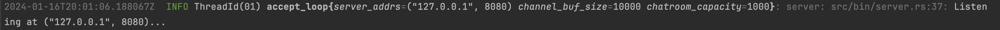
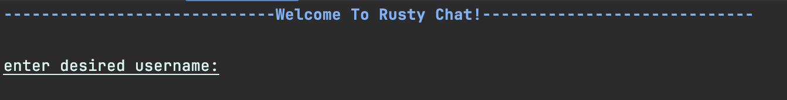
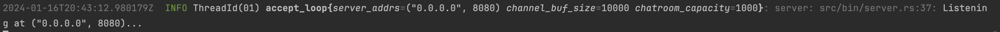
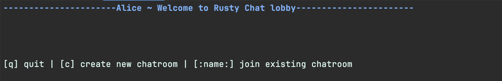
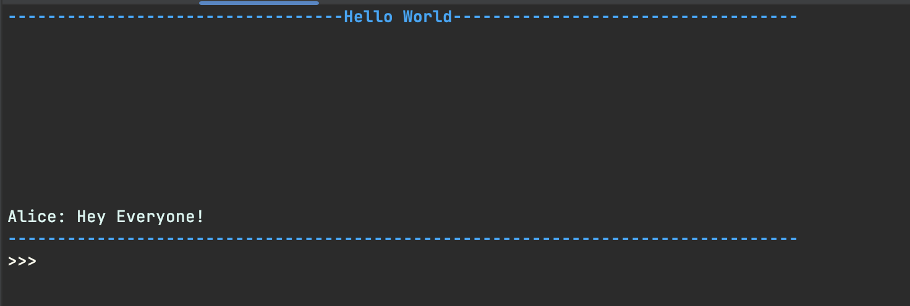
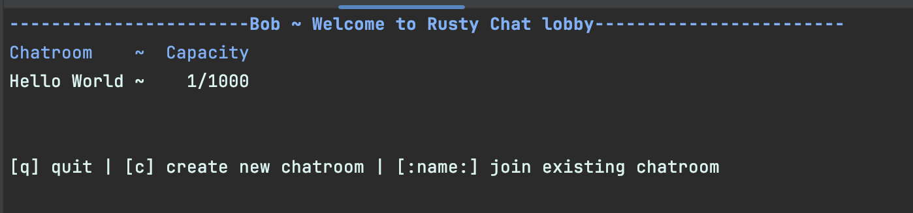
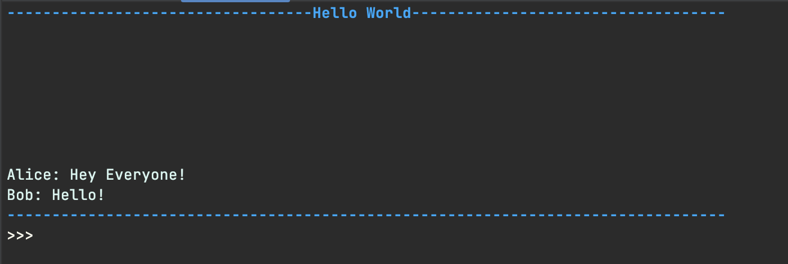

# Rusty Chat
## Description
An asynchronous chatroom server and client. The protocol for clients connecting to the server is implemented over Tcp. 
The client executable turns the terminal window into a simple user interface for interacting with the server. Once connected,
the server allows any client to:
1. join an existing chatroom
2. create a new chatroom

The server employs the actor model for managing shared state between asynchronous tasks. 

### Goals
Personal goals for this project were: to gain more experience writing asynchronous Rust code and with Rust's asynchronous ecosystem.

The main design goal of this project was to find an implementation that allowed distinct chatrooms to be managed as seperate tasks.
Instead of having one task that manages the sending and receiving of _all_ messages, _for all_ chatrooms, each chatroom could be it's own unique task, managing the sending and receiving of its own messages. This was achieved by having a main broker task, which manages shared state for all tasks, spawn sub-broker tasks for new chatrooms. These sub-brokers would exclusively manage the sending and receiving of messages to and from clients that had joined the chatroom. That way the main broker would not have to manage the sending and receiving of messages for any particular chatroom. As a result of this design, the main broker task only had to manage the sub-broker tasks as another instance of shared state.

Another design goal of this project was to transform the terminal window into a user interface, instead of having to build GUI. This was an interesting challenge and with the help of the `termion` crate, a simple working solution was found.

## Usage
To run this code, one only has to clone the repository to their local machine, and then follow the instructions for running the server or client respectively.

### Server
After cloning the repository one can pass command line arguments that configure the server. For example `RUST_LOG=info cargo run --bin server -- -a 127.0.0.1 -p 8080 -b 10000 -c 1000`.
In this example, the server is listening for incoming requests at address `127.0.0.1` and on port `8080`, the buffer size for the main broker's channel is set to `10000` and the capacity for
any chatroom is set to `1000`. Depending on the value of `RUST_LOG` (in this example a log level of info was used), one should see 

#### CLI arguments for the server

| -a | -p | -b | -c |
| --- | --- | --- | ---- |
| The address at which the server will listen for requests | The port of the server | The size of the main broker task's channel buffer, limits the number of clients that connect | The capacity of a chatroom, limits the number of clients that can be inside a single chatroom. Argument is optional and has a default of 1000 |

### Client
In order to start the client, all one needs to do is pass in the address and port of the server as command line arguments. For example `cargo run --bin client -- -a 127.0.0.1 -p 8080`, will run the client executable and connect to the server at address `127.0.0.1` on port `8080`. One should see

their terminal window is now a UI for interacting with the server.

#### CLI arguments for the client
| -a | -p |
| --- | --- |
| The address of the server the client wishes to connect too | The port of the server |

## Example
Here is a simple demonstration. We can start a server that will listen on address `0.0.0.0` using this command `RUST_LOG=info cargo run --bin server -- -a 0.0.0.0 -p 8080 -b 10000 -c 1000`. You do not have have the log level set to info, this is just personal preference. After running this command we should get output that looks something like

Now, using two other additional terminal windows, we can run the client and have them chat with each other. To do so, first open an additional terminal window and enter the following command `cargo run --bin client -- -a 0.0.0.0 -p 8080`. We should be greeted with a prompt telling us to declare our username. In this example, one client will be named Alice and the other will be Bob. After entering the user name we should enter the chatroom lobby, which will look like this

We select the option to create a new chatroom, and name the new chatroom Hello World. After doing so in the Alice client we see the chatroom UI.

In another new terminal window we can again run the client, which will be Bob. After running the program and entering the username, the Bob client's lobby will look like 

Notice how the lobby will display available chatrooms with the number of clients and capacity for each chatroom. In order for Bob to join the Hello World chatroom, all he has to do is enter the name of the chatroom and press enter. Once inside the chatroom, both Alice and Bob can began sharing messages.

